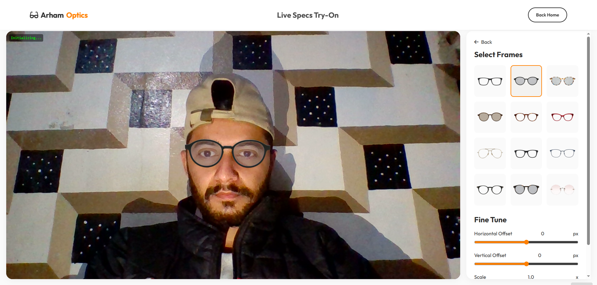
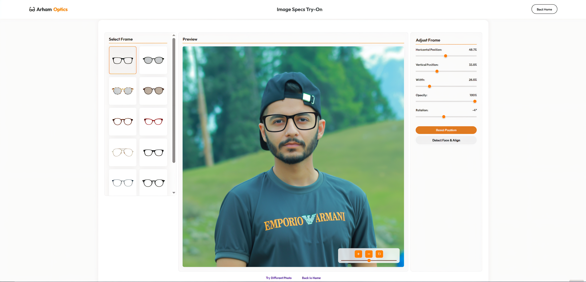

# 👓 Virtual Specs Try-On

Welcome to **Virtual Specs Try-On**, a modern web application that lets you try on glasses virtually before you buy them! Whether you want to upload a selfie or check yourself out in real-time using your webcam, we've got you covered.

It's fast, fun, and uses advanced AI to make sure those frames sit perfectly on your face.

---

## 🌟 Functionality

Here’s what you can do with this app:

*   **Live Camera Try-On**: Use your webcam to see how different frames look on you in real-time. Move your head around—the glasses stay with you!
*   **Photo Upload Try-On**: Upload a photo of yourself (or a friend!) and apply frames instantly.
*   **Smart Auto-Alignment**: Our AI detects faces and automatically positions, scales, and rotates the glasses to fit perfectly.
*   **Fine-Tune Controls**: Not quite perfect? You have full control to:
    *   Adjust position (Up/Down/Left/Right)
    *   Scale the glasses size
    *   Rotate the frames
    *   Change opacity
*   **Zoom & Pan**: Zoom in on your photo to get a closer look at the details.
*   **Manual Face Redetection**: If the initial scan missed, just hit the "Detect Face" button to try again.

---

## ⚙️ How It Works

At its core, this project combines a robust backend with an intelligent frontend:

1.  **The Brain (AI)**: We use **face-api.js**, a powerful library that runs directly in your browser. It scans your image or video feed to find facial landmarks (like your eyes and nose bridge).
2.  **The Logic**: Once the eyes are found, the app calculates the perfect angle and size for the glasses and overlays them on top.
3.  **The Server**: A **Flask (Python)** server handles the website routing and manages your uploaded images securely.

---

## 🛠️ Tech Stack

This project was built using:

*   **Frontend**: HTML5, CSS3, JavaScript
*   **Backend**: Python, Flask
*   **AI/ML**: Face-API.js (TensorFlow.js based)
*   **Styling**: FontAwesome Icons, Custom "Outfit" Font, CSS theming

---

## 🚀 Installation & Setup

Want to run this locally? Follow these simple steps:

### 1. Prerequisite
Make sure you have **Python 3.8+** installed on your machine.

### 2. Clone or Download
Download this project folder to your desktop.

### 3. Set Up Virtual Environment (Recommended)
Open your terminal (PowerShell or Command Prompt) in the project folder and run:

```powershell
python -m venv venv
.\venv\Scripts\Activate
```

### 4. Install Dependencies
Install the required packages:

```powershell
pip install -r requirements.txt
```

### 5. Run the App
Start the server:

```powershell
python app.py
```

### 6. Open in Browser
Go to your browser and visit:  
`http://127.0.0.1:5000`

---

## 📸 Screenshots

*(Add your screenshots here! Save them in a `screenshots` folder and link them below)*

| **Home Page** | **Live Try-On** | **Image Editor** |
|:---:|:---:|:---:|
|  |  |  |

---

## 👨‍💻 Developer

Developed with ❤️ by **Arham**.  
*Building the future of eyewear shopping, one line of code at a time.*

---

*Enjoy trying on your new look!* 😎
